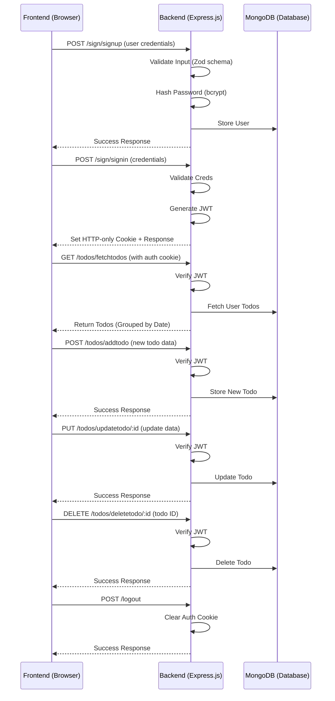
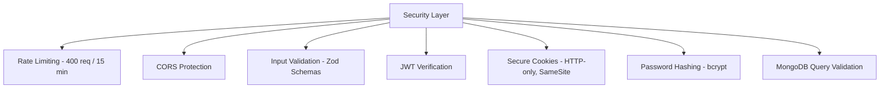

# 📝 Todo App – Documentation

A full-stack Todo application built with the **MERN stack (MongoDB, Express.js, Node.js)** and **vanilla JavaScript frontend**.  
The application features **user authentication, todo management with CRUD operations, and a responsive design**.

## 🌐 Live Demo
- [Demo 1](https://todo-project-kohl.vercel.app/)  
- [Demo 2](https://todo-project-kunal-rathores-projects-3c5b48fa.vercel.app/)

---

## 🚀 Features
- 🔐 **User Authentication** – Sign up and sign in with JWT-based authentication  
- ✅ **Todo Management** – Create, read, update, and delete todos  
- 📅 **Organized Display** – Todos grouped by creation date  
- 📱 **Responsive Design** – Works on both desktop and mobile devices  
- 🛡 **Secure Validation** – Input validation using Zod schema validation  
- 🍪 **Cookie-based Sessions** – Secure HTTP-only cookies for authentication  
- 🎬 **Lottie Animations** – Enhanced user experience with animations  

---

## 🛠 Technology Stack

### Frontend
- **HTML5** – Markup structure  
- **CSS3** – Styling with custom animations and responsive design  
- **Vanilla JavaScript** – DOM manipulation and API calls  
- **Axios** – HTTP client for API requests  
- **DotLottie** – Lottie animations for enhanced UX  

### Backend
- **Node.js** – Runtime environment  
- **Express.js** – Web framework  
- **MongoDB** – Database with Mongoose ODM  
- **JWT** – Authentication tokens  
- **bcrypt** – Password hashing  
- **Zod** – Input validation  
- **cookie-parser** – Cookie management  
- **Rate limiting** – Security middleware  

---

## ☁️ Deployment
- **Vercel** – Frontend and backend deployment  
- **MongoDB Atlas** – Cloud database  
- **Environment Variables** configured in Vercel dashboard  
- **Custom domain configuration** supported  

---


## 📂 Project Structure
```
Todo_Project/
├── backend/
│   └── server/
│       ├── CRUD/
│       │   ├── todosModel.js
│       │   └── usersModel.js
│       ├── db/
│       │   └── db.js
│       ├── middlewares/
│       │   └── auth.js
│       ├── routes/
│       │   ├── checkToken_route.js
│       │   ├── logout_route.js
│       │   ├── sign_routes.js
│       │   └── todos_routes.js
│       ├── utils/
│       │   └── utils.js
│       └── validate/
│           └── zod.js
├── client/
│   ├── assets/
│   ├── font/
│   ├── index.html
│   ├── script.js
│   └── style.css
├── .gitignore
├── index.js
├── package.json
├── package-lock.json
└── vercel.json
```

---

## 📡 API Endpoints

### 🔑 Authentication Routes
- `POST /sign/signup` – User registration  
- `POST /sign/signin` – User login  
- `POST /logout` – User logout  
- `GET /issignedin/checktoken` – Token validation  

### 📝 Todo Routes
- `GET /todos/fetchtodos` – Get user's todos  
- `POST /todos/addtodo` – Create new todo  
- `PUT /todos/updatetodo/:id` – Update todo status  
- `DELETE /todos/deletetodo/:id` – Delete todo  

---

## 🔐 Key Features Implementation

### Authentication Flow
- User signs up with validated credentials  
- Password is hashed with **bcrypt** before storage  
- JWT token generated upon successful signin  
- Token stored in **HTTP-only cookie** for security  
- Middleware validates token on protected routes  

### Todo Management
- Todos are associated with users via `userId`  
- Grouped by creation date for organized display  
- Real-time updates without page refresh  
- Toggle completion status with visual indicators  

### Security Features
- ⏳ Rate limiting (400 requests/15 minutes)  
- ✅ Input validation with Zod schemas  
- 🔑 Password complexity requirements  
- 🍪 Secure cookie settings (HTTP-only, sameSite)  
- 🌍 CORS configuration for trusted origins  

---

## ⚙️ Installation & Setup

1. Clone the repository  
   ```bash
   git clone https://github.com/Kunal-Rathore/Todo_Project.git
   cd Todo_Project
   ```
2. Install dependencies  
   ```bash
   npm install
   ```
3. Set up environment variables:
   ```env
   MONGO_URL=<your_mongo_url>
   JWT_TOKEN=<your_jwt_secret>
   JWT_EXPIRY=<token_expiry_time>
   ```
4. Start development server  
   ```bash
   node index.js
   ```

---

## 📦 Future Enhancements
- 📧 Email verification for new users  
- 🔑 Password reset functionality  
- 🏷 Todo categories/tags  
- 🔗 Social media authentication (Google/GitHub)  
- 🔍 Advanced filtering and search  

---

## 🧑‍💻 Developer Notes
This project demonstrates **full-stack development capabilities** with modern web technologies.  
The architecture separates concerns with clear division between frontend and backend responsibilities.  

- **Security considerations** include input validation, password hashing, and secure cookie management.  
- The use of **vanilla JavaScript** instead of a framework shows fundamental DOM manipulation skills while keeping the application lightweight.  
- **Responsive design** ensures accessibility across various device sizes.  

---

## 📸 Screenshots
*(Add actual screenshots of application here will upload later)*  
- Landing page with sign up/sign in options  
- Todo dashboard with todos organized by date  
- Mobile-responsive design  

---

## 🙌 Acknowledgments
- **LottieFiles** for animations  
- **Vercel** for deployment platform  
- **MongoDB Atlas** for database hosting  
- **Express.js team** for the web framework  

---

## 🖧 System Workflow Diagram



---


## 🛡️ Security Layer



---

## 📜 License
This project is licensed under the **MIT License**.  

> Built with dedication and attention to detail. Every line of code was crafted to ensure both functionality and maintainability.
